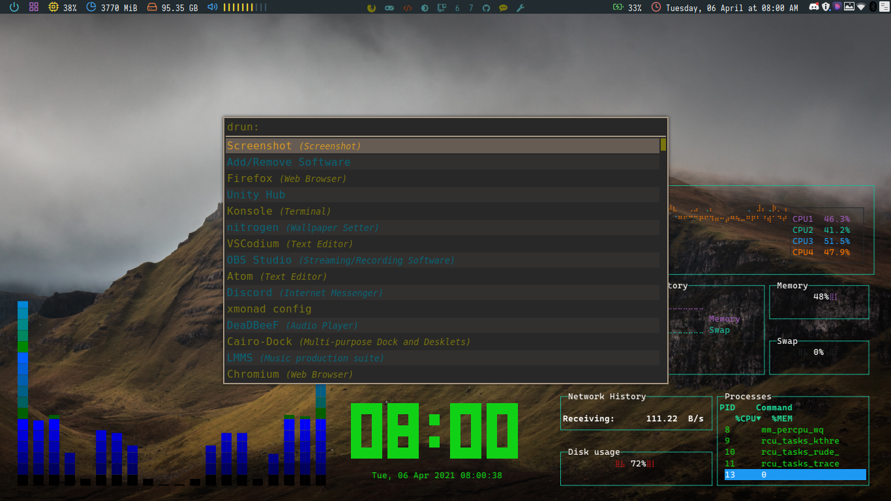
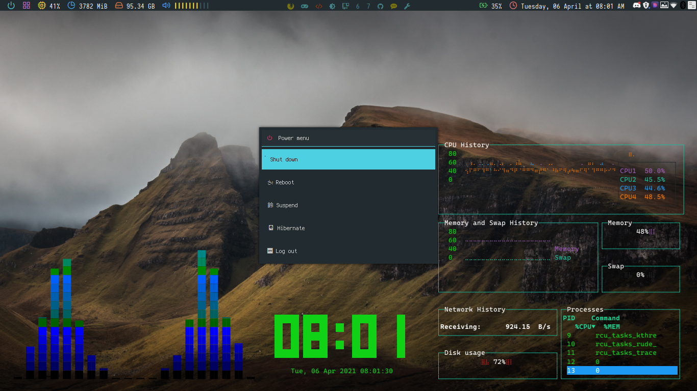
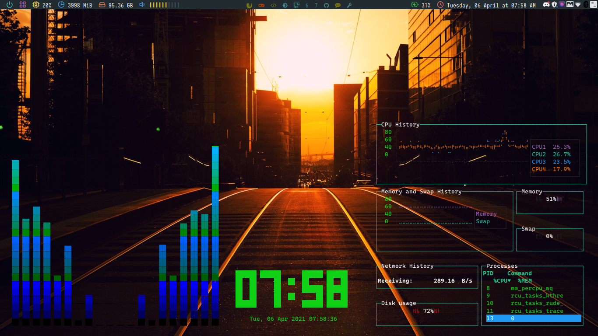

# Dotfiles

These are my dotfiles. They include my configs for polybar, xmonad, nano, and picom. A few notes:

The picom config file is for use with this fork:
https://aur.archlinux.org/packages/picom-tryone-git/

And the configs are loosely based off of:
Arcolinux xmonad configs
Polybar-themes on github

Screenshots

